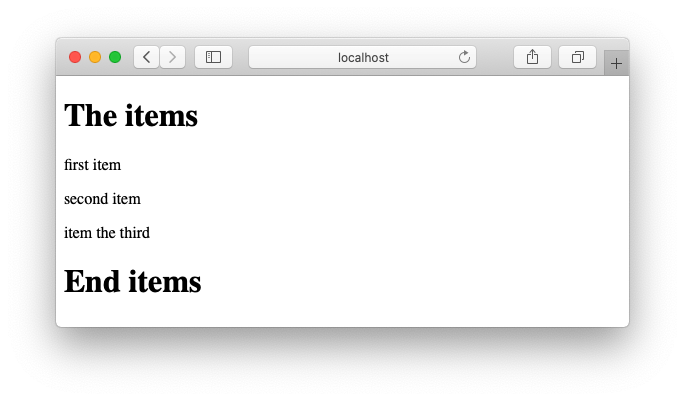

# eleventy\_mdx\_example\_2024

I was inspired by [Better 11ty Development with Tooling](https://www.jetbrains.com/guide/javascript/tutorials/eleventy-tsx)
to try out [eleventy](https://www.11ty.dev) but I also wanted to use [MDX](https://mdxjs.com) so that I could reuse some
things from another React application.

Searching for "eleventy mdx" turned up [@jamshop/eleventy-plugin-mdx](https://github.com/jamshop/eleventy-plugin-mdx)

I was eventually able to get everything to work but I encountered several gotchas so I decided to put together
a small **working** example for anyone else like me who is new to all this stuff.


## Principle of operation

```
    _layouts/Main.njk
    ┌──────────────────────────────────┐
    │ ---                              │
    │ title: eleventy_mdx_example_2024 │                                   
    │ ---                              │                                    rendered output
    │                                  │       ───────────────────────────────────┴────────────────────────────────────────
    │ <!doctype html>                  │       <!doctype html>
    │ <html lang="en">                 │       <html lang="en">
    │   <head>                         │         <head>
    │     <meta charset="utf-8">       │           <meta charset="utf-8">
    │     ...                          │           ...
    │     <title>{{ title }}</title> ────────────▶ <title>eleventy_mdx_example_2024</title>
    │   </head>                        │         </head>
    │   <body>                         │         <body>
    │    {{ content | safe }} ────────────────────▶ <div id="MDX_ROOT_5035abcf-2bbc-4228-ba11-8afb5d64d9b5">
    │   </body>  ▲                     │              <h1>The items</h1>
    │ </html>    │                     │                <div><p>first item</p><p>second item</p><p>item the third</p></div>
    └────────────│─────────────────────┘              <h1>End items</h1>
                 │                                  </div>
                 │                               </body>
                 │                             </html>
                 │                             ────────────────────────────────────────────────────────────────────────────
                 │
                 │ eleventy provides Main.njk
                 │ with the result of expanding
                 │ index.mdx
                 │
    index.mdx    │                                 items.tsx
    ┌────────────│────────────────────────┐        ┌─────────────────────────────────────────────────────┐
    │ ---        │                        │        │ import React from 'react';                          │
    │ layout: Main.njk                    │        │ import { z } from 'zod';                            │
    │ ---                                 │        │ export type  DataItems = z.infer<typeof DataItems>; │
    │                                     │        │ export const DataItems = z.string().array()         │
    │ import { Items } from './items'; ◀──────────── export const Items =                                │
    │                                     │        │   ({ items }:{ items: DataItems }): JSX.Element =>  │
    │ <Items items={props.items}/>        │        │ {                                                   │
    │                  ▲                  │        │   return (                                          │
    └──────────────────│──────────────────┘        │     <div>                                           │
                       │                           │       {                                             │
    ───────────────────┴───────────────────        │       DataItems                                     │
    eleventy helpfully                             │       .parse(items)                                 │
    provides the  "props.items" object with        │       .map( i => <p key={ i }>{ i }</p> )           │
    the data from "_data/items.json" file          │       }                                             │
    because our .eleventy.js specifies             │     </div>                                          │
                                                   │   );                                                │
     return {                                      │ };                                                  │
       dir: {                                      └─────────────────────────────────────────────────────┘
         data:    "_data",
         ...      ━━━━━━━
       }
     }
    ─────────────┬────────────────────────
                 │
                 │
         _data/items.json
         ┌────────────────────┐
         │ [                  │
         │   "first item",    │
         │   "second item",   │
         │   "item the third" │
         │ ]                  │
         └────────────────────┘
```

## Prerequisites

* [Just](https://github.com/casey/just)

I use this on all my projects.  The `.justfile` is pretty simple so if you
don't have it you can "just" take a quick look and run the pnpm commands manually.

## To run

```
% git clone https://github.com/jq170727/eleventy_mdx_example_2024
% cd eleventy_mdx_example_2024
% just
```

<details>
  <summary>
  Sample run
  </summary>

    % just
      pnpm install
      Packages: +304
      +++++++++++++++++++++++++++++++++++++++++++++++++++++++++++++++++++++++++++++++++++++++
      Progress: resolved 342, reused 304, downloaded 0, added 304, done
      
      dependencies:
      + @jamshop/eleventy-plugin-mdx 0.0.17
      + react 18.3.1
      + react-dom 18.3.1
      + zod 3.23.8
      
      devDependencies:
      + @11ty/eleventy 3.0.0-alpha.10
      + jsx-async-runtime 0.1.8 (0.2.1 is available)
      + tsx 4.11.0
      
       WARN  Issues with peer dependencies found
      .
      └─┬ @jamshop/eleventy-plugin-mdx 0.0.17
        └─┬ @mdx-js/react 1.6.22
          └── ✕ unmet peer react@"^16.13.1 || ^17.0.0": found 18.3.1
      
      Done in 2.8s
      pnpm run start
      
      > @ start /private/tmp/eleventy_mdx_example_2024
      > tsx node_modules/@11ty/eleventy/cmd.cjs --config=.eleventy.ts --serve --incremental
      
      [11ty] Writing ./public/index.html from ./main/index.mdx
      [11ty] Wrote 1 file in 0.23 seconds (v3.0.0-alpha.10)
      [11ty] Watching…
      [11ty] Server at http://localhost:8080/

</details>
    
Open http://localhost:8080 in your browser if necessary.  You should see a page
    


